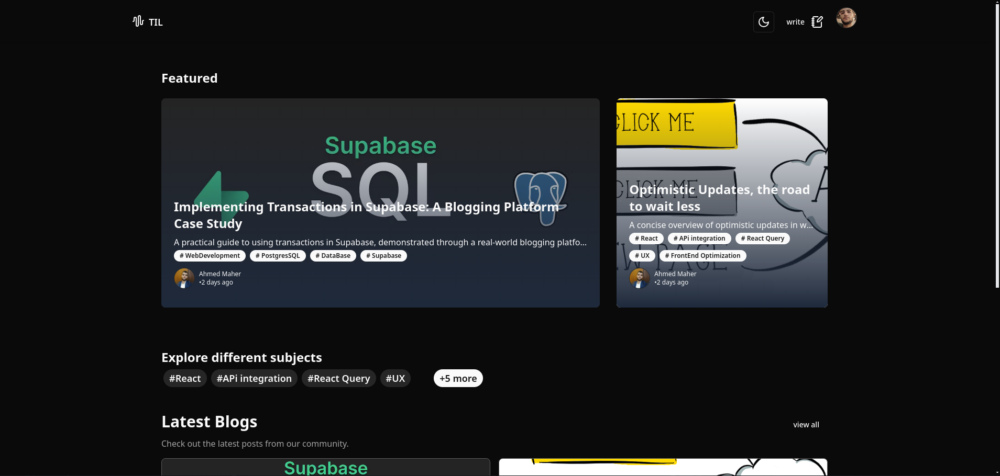

# TIL - Blogging Platform

![][ci] ![][views] ![][stars] ![][forks] ![][issues] ![][license] ![][repo-size]


<div align='center'>

<!-- logo/title -->
<picture>
  <source media="(prefers-color-scheme: dark, (max-width:300px))" srcset="./public/logo-white.svg">
  <source media="(prefers-color-scheme: light,(max-width:300px))" srcset="./public/logo.svg">
  
</picture>

 This is a feature-rich blogging platform built with Vue 3, using chadcn-vue, Supabase, and TypeScript.

</div>

<picture style="min-height:500px;">
  <source media="(prefers-color-scheme: dark, (max-width:300px))" srcset="./public/docs/TIL-dark.png">
  <source media="(prefers-color-scheme: light,(max-width:300px))" srcset="./public/docs/TIL-light.png">
  
</picture>

<div align='center'>

  **[<kbd> <br> &nbsp;**Live Demo**&nbsp; <br> </kbd>][site]**
  
</div>
## Features

- User authentication with Google login
- Create, read, update, and delete blog posts
- Markdown support for writing blog posts
- View tracking for blog posts
- Tag management for blog posts
- User profiles
- Dark mode support
- File storage using Supabase Storage
- Transaction-like operations using PostgreSQL functions

## Technology Stack

- Vue 3
- TypeScript
- Supabase for backend, authentication, and file storage
- PostgreSQL functions for complex database operations
- chadcn-vue for UI components
- Markdown parser for blog post content
- Vitest for unit testing
- Vue Test Utils for component testing

## Getting Started

1. Clone the repository
2. Install dependencies: 
  ```sh
  pnpm install
  ```
3. Set up your Supabase project and add the credentials to your environment variables
4. Set up Supabase Storage buckets for file uploads
5. Create necessary PostgreSQL functions in your Supabase project
6. Run the development server: 
```sh 
pnpm run dev
```


## Testing

This project uses Vitest for unit testing and Vue Test Utils for component testing.

To run unit tests:
```sh
pnpm run test:unit
```

To run tests with coverage:
```sh
pnpm run test:unit:coverage
```

To run E2E tests:
```sh 
pnpm run test:e2e
```

## Project Structure

- `src/components`: Vue components
- `src/stores`: Pinia stores for state management
- `src/composables`: Reusable Vue composition functions
- `src/router`: Vue Router configuration
- `.spec.ts`: Test files
- `cypress` : E2E tests

## Key Components to Tested

1. Authentication components (e.g., LoginWithGoogle)
2. Blog post components (CreateBlogForms, MediaUpload)
3. Tag management components
4. User profile components
5. Navigation components
   <!-- 6. Comment system components adding -->
   <!-- 7. Search functionality adding -->
   <!-- 8. Pagination component adding -->
6. Rich text editor component


## Star History
<div align='center'>
<a href="https://star-history.com/#ahmedmaher2481998/TIL">
 <picture>
   <source media="(prefers-color-scheme: dark)" srcset="https://api.star-history.com/svg?repos=ahmedmaher2481998/TIL&theme=dark" />
   <source media="(prefers-color-scheme: light)" srcset="https://api.star-history.com/svg?repos=ahmedmaher2481998/TIL" />
   
 </picture>
</a>
</div>

## Contributors:

[![][contributors]][contributors-graph]

_Note: It may take up to 24h for the [contrib.rocks][contrib-rocks] plugin to update because it's refreshed once a day._


## License

This project is licensed under the [Apace.2 License] - see the [LICENSE.md](./License) file for details.


<!----------------------------------{ Labels }--------------------------------->

[views]: https://komarev.com/ghpvc/?username=TIL&label=view%20counter&color=red&style=flat
[repo-size]: https://img.shields.io/github/repo-size/ahmedmaher2481998/TIL
[issues]: https://img.shields.io/github/issues-raw/ahmedmaher2481998/TIL
[license]: https://img.shields.io/github/license/ahmedmaher2481998/TIL
[forks]: https://img.shields.io/github/forks/ahmedmaher2481998/TIL?style=flat
[stars]: https://img.shields.io/github/stars/ahmedmaher2481998/TIL
[contributors]: https://contrib.rocks/image?repo=ahmedmaher2481998/TIL&max=500
[contributors-graph]: https://github.com/ahmedmaher2481998/TIL/graphs/contributors
[contrib-rocks]: https://contrib.rocks/preview?repo=ahmedmaher2481998%2TIL
[ci]: https://github.com/ahmedmaher2481998/TIL/actions/workflows/ci.yml/badge.svg

<!-----------------------------------{ Links }---------------------------------->

[site]: https://todayilearn.vercel.app
